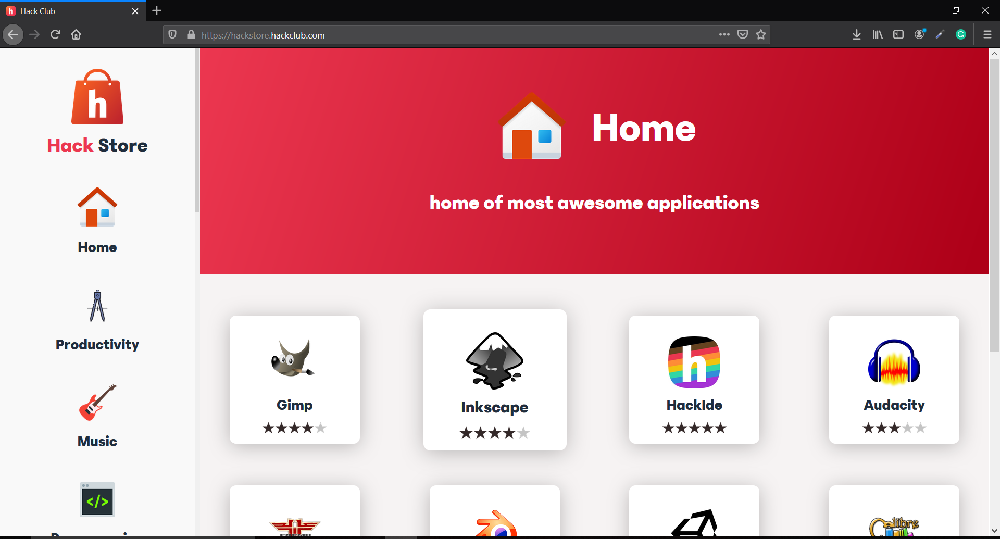

# Hack Store

 

 
 

This is the documentation of **Hack Store and is under development.**
You can visit Hack Store at <a href="https://hackstore.hackclub.com/" >https://hackstore.hackclub.com/</a>. **It is an online dummy version of the software interface.**

## What is Hack Store?

Hack store is a web interface that contains a collection of educational resources. Hack Store is part of **Hack Box** , which is an initiative to provide free-of-cost resources to the **most remote places of the world without the requirement of the internet connectivity.**

## How will this thing work?

Okay, so we said it will provide all of its resources offline and you are wondering how?

 
 

We will be shipping all of these software **inside an SD card which will contain Raspberry OS system image (it will have Hack Store server pre-installed in it)** and once it will be plugged in a Raspberry Pi ,Hack Store will be **available to everyone who will be connected to the same wifi network** on which the Raspberry Pi is running.

Once you have plugged in the sd card just go to your browser and type http://box.local and if that doesn't work then try http://ipaddressofraspberrypi, here ipaddressofraspberrypi is the ipadress of the Raspberry Pi on which the server is running!

## How will people recieve updates?

Once we ship the SD card with Hack Store in it, **We will be maintaining an online website where the latest SD card image will be available**, someone in the place (we will be shipping sd cards to places with very less access to the the internet) who has access to the the internet can download it with a download manager over a phase of time and then can boot the sd card with new system Image which will give them access to new updates.

## Why is this project Important?

There are a lot of places in the world where the internet is limited and hence they can't exercise the benefits of the internet that we do.The resources being provided in Hack Store will be providing them educational tools be it software,course books, or anything else.

**The project is aimed to spread the power of the internet to the most remort places in the world.**

## What resources are included in Hack Store?

The following resources are being distributed in Hack Store:

- **Graphic Manipulation Software** (like GIMP, Inkscape etc)
- **Music Editing Software** (like Audacity)
- **Video Editing and 3d Modelling Software** (like Davinci Resolve, Blender etc)
- **Development Environments** (We are providing software like Vscode,Android,HackIDE, Studion for software development)
- **Linux Distributions** (We are providing a lot of Linux Distributions like Kali Linux,Linux Mint etc)
- **Programming Languages** (We are providing programming languages like python,java etc)
- **Ebooks** (on programming, maths, physics, literature etc)
- **Hack Club's AMAs** (We are providing all Hack Club's AMAs with it)
- **Courses** (We are providing **FreeCodeCamp** courses on various programming discipline)
- **Games** (We are providing HTML5 games so that people can also learn how to make them by seeing their source code)
- **Javascript Libraries** ( We are providing various javascript libraries react,vue,jquery etc )
- **Khan Academy** (We are providing Khan Academy courses)
- **Hack Club's Workshops** (We are providing Hack Club's workshops with it)

## How can I help?

Okay! So you find this project amazing and you too want to contribute to it?

 
 

Before we list down how can you contribute some general information, **Whatever resource you provide ensure that they are in a zip file,they don't require internet, they don't have any copyright issue.**

Your point of contact to get your work uploaded to Hack Store will be **Harsh Bajpai**. His contact details have been mentioned in the last section of this README.

You can contribute in the following domains:

- **Khan Academy Course** : You can download Khan Academy course playlist from Youtube and number the videos in their order and compress them in a zip file and then upload them to a drive.

  If you want to know how to order them then this is a <a href="https://drive.google.com/file/d/1BOTwFerlVmytk1FdygE3W5dt5sfaTTcF/view?usp=sharing" >**link**</a> to a current Hack Store Khan Academy Playlist being used in Hack Store. Ensure that you too number Khan Academy playlist videos in the following manner only.

- **Games**: If you are a game developer then you can be a great help to us.Compress your games into a zip file and upload them to a drive and share the link with Harsh Bajpai and he will add your game to Hack Store.

  **Please try to provide screenshots of your game and ensure that your games can run totally offline.**

- **Books**: We have an ebooks section in Hack Store and if you have some awesome books then please share them with us , compress them in a zip and along with a short summary of your book send it to Harsh Bajpai.

  Please ensure that the books you provide are copyright free, you can try project <a href="https://www.gutenberg.org/">Gutenberg</a> to find such books.

- **Music**: If you are a music creator and create music then you can share your music too with us it can help others too learn from your composition.

  Ensure your music doesn't have any copyright issues associated with it, compress it in a zip file, and share it with us.

- **Javascript Libraries**: If you have some Javascript Libraries that you think will be helpful to someone in their development process then do share it with us.

  Ensure that all of the dependencies of the Js libraries are included in the zip and they should be able to work completely offline. We already have some libraries in Hack Store you can check it out to get an idea of it.

- **Course and Software**: If there are some software or course that you think can be helpful to someone that do share it with us.

  **Ensure this software don't have any redistribution issues and it would be better if the software is from open-source communities.**

- **Documentation**: If you think you can edit this documentation and make it better than you are more than welcome.

- **Development**: The project is open-source ( : , Hence we would love to see more contributions in it's source code.If you think you can implement some parts of it better go ahead and we are waiting for your countribtuion.

## When will the SD card Image Be Available?

 
 

We are currently in the testing phase and hence Hack Store is in Beta.We will very soon be done with our testing phase and then we will be uploading the SD card Image for everyone to download it and try it on your Raspberry Pi ( :

## Who should I contact for Help?

Our point of contact for you will be **Harsh Bajpai**, If you have any queries or if you want to get your contributions added to Hack Store contact him.

His contact details are :

**Email:** bajpaiharsh244@gmail.com

**He is also available on Hack Club's Slack**

**Slack Id:** U010XUNLX40

**Slack Username:** Harsh Bajpai
